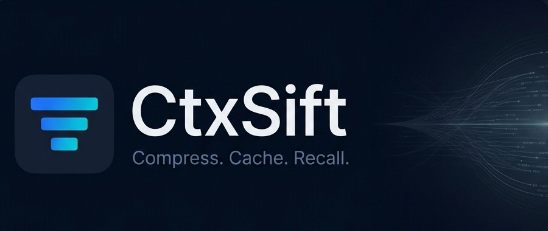

# Save tokens and extend your coding sessions

<p align="center">
  
</p>

[](https://pypi.org/project/ctxsift/)
[](https://github.com/aakashh242/ctxsift/actions/workflows/ci.yml)
[](https://github.com/aakashh242/ctxsift/actions/workflows/docs-ci.yml)
[](https://github.com/aakashh242/ctxsift/blob/main/LICENSE.md)

---

Command outputs and state recollection are the biggest source of token overuse. 

Agents consume raw command outputs for most tasks. But often, LLMs don't need entire outputs to be able to 
answer something or figure out a situation. This not only increases token usage but also affects speed of responses. 
It compounds in complex, multistep tasks where rounds of context compaction cause the agent to re-read and re-run
commands to get back to speed with latest code state. Just compressing command outputs is not enough - it shifts the
token tax to these recollection moments. 

**CtxSift** (pronounced Context Sift) is a skill that helps agents sift through the repeated noise and find the real signals needed for every task.
It compresses tool outputs and caches them so that agents can do a look-up when needing context or recollecting.

---

## Getting Started

### Prerequisites

- **Python ≥ 3.12** — [python.org/downloads](https://www.python.org/downloads/)
- **uv** — a fast Python package manager
  - Install: [docs.astral.sh/uv/getting-started/installation](https://docs.astral.sh/uv/getting-started/installation/)
- C compiler
  - Linux: [gcc](https://gcc.gnu.org/install/) or [clang](https://clang.llvm.org/get_started.html)
  - Windows: [Visual Studio](https://visualstudio.microsoft.com/downloads/) or [MinGW-w64](https://www.mingw-w64.org/downloads/)
  - MacOS: [Xcode](https://developer.apple.com/xcode/)


### Install

CtxSift uses a language model to compress tool outputs. This can be a model running locally or hosted remotely.
You can choose the installation path best suited to your environment. When using local models, you can override the default
model - see the [supported models](#local-model-support) section for further details. 


> ❗ For the best experience, please see the minimum hardware requirements below.
> 
> <details>
> <summary>Requirements matrix</summary>
>
> | Compression Mode | Minimum RAM | Minimum VRAM | Comments |
> |---|---|---|---|
> | Local, no GPU | 8 GB | N/A | Both embedding and compression models are loaded into RAM. |
> | Local, with GPU | 2 GB | 8 GB | Both embedding and compression models can move to VRAM, but you still need a CUDA-aligned PyTorch wheel and working NVIDIA drivers. |
> | Remote, no GPU | 4 GB | N/A | Only the embedding model gets loaded into RAM. |
> | Remote, with GPU | 2 GB | 4 GB | Remote compression stays remote; only local embeddings use VRAM. This also needs a CUDA-aligned PyTorch wheel if you want embeddings on GPU. |
> 
> </details>


```bash 
# Install the base package - inference runs on CPU
uv tool install ctxsift

# Install with GPU add-ons - local compression + embeddings on GPU
uv tool install "ctxsift[gpu]" --index https://download.pytorch.org/whl/cu121

# Enable quantization support on GPU
uv tool install "ctxsift[gpu,quant]" --index https://download.pytorch.org/whl/cu121

# Install with LiteLLM included - use remotely hosted models for compression
uv tool install "ctxsift[remote]"

# Install for remote compression plus local GPU embeddings
uv tool install "ctxsift[remote,gpu]" --index https://download.pytorch.org/whl/cu121

# Install the full package
uv tool install "ctxsift[all]" --index https://download.pytorch.org/whl/cu121
```

`ctxsift[gpu]` and related extras add Python-side GPU dependencies, but they do not install NVIDIA drivers or automatically replace the default PyTorch wheel with a CUDA build. If `torch.cuda.is_available()` is false, CtxSift will still run on CPU even if the extra is installed.

If `ctxsift` is not found after installation, run:

```bash frame="none"
uv tool update-shell
```

Then restart your shell and try `ctxsift` again.

### First-time setup

Run a guided setup to configure your model provider, workspace settings and **install the skill** for your favorite agent harness.

```bash frame="none"
ctxsift configure
```

### Verify and test your setup

```bash frame="none"
# Verify
ctxsift doctor

# Test compression
echo "alpha\nbeta\ngamma" | ctxsift compress --intent exact-lines "Return only the first line, no explanations."
```

---

## Local Model Support

CtxSift uses two model uses under the hood: one model for **compression**, and one model for **embeddings** used by recall. Those two uses are configured separately.

By default, compression runs locally with a small GGUF model that is safe to start on CPU through embedded `llama.cpp`. 
If you prefer a hosted provider, you can switch compression to a remote LiteLLM-compatible endpoint instead.
Embeddings are separate: CtxSift currently uses a local Sentence Transformers-compatible embedding model for storing and recalling records, even when compression itself is remote.

| Component | Default                                                                                    | When it is used | Conditions and notes |
|---|--------------------------------------------------------------------------------------------|---|---|
| Local compression | [ibm-granite/granite-4.0-350m-GGUF](https://huggingface.co/ibm-granite/granite-4.0-350m-GGUF) | Used by default | Active when `remote.base_url` is not set. On CPU, local compression uses embedded `llama.cpp` with a Hugging Face GGUF repo id plus one GGUF filename. On CUDA, local compression uses the Transformers backend and a normal Hugging Face text-generation model id. Guided `ctxsift configure` steers CPU setups toward `ibm-granite/granite-4.0-350m-GGUF` and CUDA setups toward `LiquidAI/LFM2.5-1.2B-Instruct`. You can switch model, GGUF filename, device, dtype, attention backend, and quantization through config. |
| Remote compression | Off by default                                                                             | Used only when remote mode is configured | Becomes active when `remote.base_url` and `remote.model_name` are set. Usually also needs an API key, depending on the provider. Requires `ctxsift[remote]` because remote compression goes through LiteLLM. This replaces local compression, but not local embeddings. |
| Embeddings for recall | [microsoft/harrier-oss-v1-0.6b](https://huggingface.co/microsoft/harrier-oss-v1-0.6b)      | Used for storing and recalling records | This path is used regardless of whether compression is local or remote. The model must be compatible with Sentence Transformers. |

### Changing Models

For CPU-based environments, you can configure any GGUF-quantized text-generation models supported by `llama.cpp`. 
For GPU-based environments, any text-generation models from HuggingFace can be used. The choice is endless, based on your hardware.

We have [benchmarked](benchmark) a few models to help you get started.
You can also run the benchmark to see how a model not listed here will perform. Learn more about it [here](benchmark/README.md).
To view the latest benchmark, open `benchmark/results/viewer.html` to inspect the latest static dashboard snapshot. The viewer now shows two score views: **recovered** as the main score, and **raw** beside it so you can see how much deterministic recovery helped. It also shows visible-thought density, so you can tell when a model is "thinking out loud" in the final answer instead of returning only the requested output. That includes both leaked think-tags and common meta lines like `Okay, the user wants...` or `I should return...`. Benchmark scoring now follows the explicit compression intent for each case, so strict outputs are judged by the contract the caller actually asked for, not by an older family label.

**CPU models** - GGUF quantized models running on CPU via the built-in `llama.cpp` engine. Sorted by average latency, fastest first.

<details>
<summary>Benchmarked CPU models</summary>

> Scores below come from the latest local CPU benchmark snapshot at `benchmark/results/cpu-models-20260524T014526Z` on an i7-12700F with 64 GiB RAM. `Score` here means the benchmark's main recovered score. Treat latency as relative, not absolute.

| Name | Avg. Inference (s) | Score | Comments |
|------|:-:|:-:|---|
| [granite-4.0-350m-GGUF](https://huggingface.co/ibm-granite/granite-4.0-350m-GGUF) **(default)** | 2.14 | 46.93 | Fastest tested CPU model and still the built-in default. Good first-run choice when you want minimal setup friction, but not the strongest quality pick. |
| [LFM2.5-350M-GGUF](https://huggingface.co/LiquidAI/LFM2.5-350M-GGUF) | 2.38 | 49.92 | Nearly as fast as Granite 350M, with noticeably better quality and fewer hard failures. Strong low-latency CPU option. |
| [Qwen2.5-0.5B-Instruct-GGUF](https://huggingface.co/Qwen/Qwen2.5-0.5B-Instruct-GGUF) | 3.30 | 53.06 | Fast and surprisingly strong for its size, but more rejects than the best CPU options. Good if you care about speed first and can tolerate some misses. |
| [gemma-3-270m-it-GGUF](https://huggingface.co/unsloth/gemma-3-270m-it-GGUF) | 3.53 | 38.55 | Very small and still quick, but quality is weak and rejects are high. Only makes sense when RAM or patience is extremely limited. |
| [Qwen2.5-Coder-0.5B-Instruct-128K-GGUF](https://huggingface.co/unsloth/Qwen2.5-Coder-0.5B-Instruct-128K-GGUF) | 3.67 | 51.86 | Balanced CPU option with decent speed and fewer rejects than base Qwen2.5-0.5B. Worth a look for code-heavy workflows. |
| [Qwen3.5-0.8B-GGUF](https://huggingface.co/unsloth/Qwen3.5-0.8B-GGUF) **(recommended)** | 4.54 | **56.45** | Best CPU model overall in the current run. Clear score leader, still reasonably fast, and only 16 rejected cases out of 280. |
| [SmolLM2-360M-Instruct-GGUF](https://huggingface.co/unsloth/SmolLM2-360M-Instruct-GGUF) | 5.48 | 47.64 | Small and workable, but not clearly better than faster alternatives above it. Fine as a lightweight fallback. |
| [gemma-3-1b-it-GGUF](https://huggingface.co/unsloth/gemma-3-1b-it-GGUF) | 5.55 | 40.15 | Middling quality for the latency. Hard to recommend over the faster and stronger Qwen and LFM options nearby. |
| [LFM2.5-1.2B-Instruct-GGUF](https://huggingface.co/LiquidAI/LFM2.5-1.2B-Instruct-GGUF) | 6.48 | 48.25 | Very low hard-reject count, but many soft accepts pull the score down. Interesting if you care most about avoiding outright failures. |
| [LFM2-700M-GGUF](https://huggingface.co/LiquidAI/LFM2-700M-GGUF) | 6.76 | 49.15 | Reasonable middle-ground model, but slower than several better-scoring CPU choices. Usually not the first swap to try. |
| [LFM2-350M-Extract-GGUF](https://huggingface.co/LiquidAI/LFM2-350M-Extract-GGUF) | 7.81 | 39.74 | This extract-tuned variant is not a strong general compression pick in the benchmark. Usually skip it for CtxSift. |
| [Qwen3-0.6B-GGUF](https://huggingface.co/unsloth/Qwen3-0.6B-GGUF) | 13.91 | 53.10 | Good score, but far too slow on CPU relative to Qwen3.5-0.8B. Only worth it if you specifically want the Qwen3 family. |

</details>

<details>

<summary>Benchmarked GPU models</summary>

**GPU models** - full-precision Transformers models running on CUDA. Sorted by average latency, fastest first. Tested on an RTX 3060 Ti (8 GiB).

> Scores below come from the latest local GPU benchmark snapshot at `benchmark/results/gpu-models-20260524T212353Z`. `Score` here means the benchmark's main recovered score. GPU latency depends heavily on your card, drivers, and VRAM pressure.

| Name | Avg. Inference (s) | Score | Comments |
|------|:-:|:-:|---|
| [LFM2.5-1.2B-Instruct](https://huggingface.co/LiquidAI/LFM2.5-1.2B-Instruct) **(recommended)** | 0.81 | 54.61 | Fastest GPU model by a wide margin and still strong enough to be the practical default for CUDA setups. Best speed-to-quality starting point. |
| [Qwen3.5-0.8B](https://huggingface.co/Qwen/Qwen3.5-0.8B) | 3.43 | 59.13 | Strong small GPU model. Much faster than the 2B-tier options while still posting a very good score. |
| [Qwen2.5-1.5B-Instruct](https://huggingface.co/Qwen/Qwen2.5-1.5B-Instruct) | 7.80 | 59.28 | Slightly edges out Qwen3.5-0.8B on score, but at more than double the latency. Good if you want a strong mid-size GPU model. |
| [gemma-3-1b-it](https://huggingface.co/unsloth/gemma-3-1b-it) | 11.81 | 42.69 | Weak for the latency and rejection profile. Not a strong CUDA pick for CtxSift. |
| [granite-4.0-micro](https://huggingface.co/ibm-granite/granite-4.0-micro) | 15.30 | 47.45 | Usable, but outclassed by faster or better-scoring Qwen and LFM models in the same benchmark set. |
| [Qwen3.5-2B](https://huggingface.co/Qwen/Qwen3.5-2B) | 16.92 | **61.07** | Best GPU score in the current run. This is the higher-quality CUDA upgrade if you are willing to spend much more latency for it. |
| [granite-3.3-2b-instruct](https://huggingface.co/ibm-granite/granite-3.3-2b-instruct) | 17.43 | 46.43 | Reliable enough, but the score does not justify the latency relative to better Qwen options. |
| [SmolLM2-1.7B-Instruct](https://huggingface.co/HuggingFaceTB/SmolLM2-1.7B-Instruct) | 17.67 | 53.00 | Decent fallback GPU model with moderate quality, but not compelling against LFM for speed or Qwen for quality. |
| [Qwen3-1.7B](https://huggingface.co/Qwen/Qwen3-1.7B) | 33.80 | 58.05 | Good score, but the latency is steep. Hard to justify unless this exact model family matters to you. |

</details>

<details>

<summary>Benchmarked remote models</summary>

**Remote / hosted models** - models accessed through a LiteLLM-compatible endpoint such as OpenAI. Requires `ctxsift[remote]`. Sorted by average latency, fastest first. Note that we have benchmarked OpenAI models but other providers are also supported.

> Scores below come from the latest local remote benchmark snapshot at `benchmark/results/remote-models-20260523T233753Z`. `Score` here means the benchmark's main recovered score. Remote latency depends on your network path and provider load.

| Name | Avg. Inference (s) | Score | Comments |
|------|:-:|:-:|---|
| [gpt-4.1](https://platform.openai.com/docs/models) | 1.33 | **88.17** | Best remote model in the current run and also the fastest among the serious contenders here. Highest quality ceiling with just 1 rejected case. |
| [gpt-4o](https://platform.openai.com/docs/models) | 1.43 | 86.28 | Strong all-rounder with good speed and quality. Better current benchmark result than its `mini` sibling, but with more rejects than `gpt-4.1`. |
| [gpt-4o-mini](https://platform.openai.com/docs/models) | 1.52 | 84.61 | Very fast and very reliable, with only 1 rejected case. Good remote default when cost matters more than absolute top score. |
| [gpt-4.1-mini](https://platform.openai.com/docs/models) | 1.59 | 86.99 | Close to `gpt-4.1` quality while staying quick. A strong hosted pick if you want most of the quality without using the flagship model. |
| [gpt-5.4-nano](https://platform.openai.com/docs/models) | 1.83 | 85.73 | Fast and solid in the current run. Good value candidate if you specifically want this family. |
| [gpt-5.4-mini](https://platform.openai.com/docs/models) | 2.11 | 86.68 | Highest accepted-case count in the remote set, but slightly slower than the 4.1 and 4o family models above it. Strong choice. |
| [gpt-5-mini](https://platform.openai.com/docs/models) | 7.40 | 32.13 | Also performed poorly in the current run, with many empty or invalid outputs. Not recommended. |

</details>

To learn more about the benchmark based on which, we recommend alternate models, please [see here](benchmark/README.md).

---

## How it works

CtxSift has two core operations that the skill injects into an agent's workflow.

1. **Compress**: CtxSift intercepts the raw tool outputs and passes them through another LLM to extract only what the agent requires. These compressed records are cached for recall.
    
    The agent specifies its needs via an instruction in either of the ways belows.
    **Pipe mode** — pipe any command output with a natural language instruction:
    ```bash frame="none"
    pytest -q | ctxsift compress --intent summary "show only failing tests, useful traceback lines, and files involved"
    ```
    **Command capture mode** — let CtxSift execute the command directly for richer metadata (exit code, duration, stderr, git state):
    ```bash frame="none"
    ctxsift compress --intent summary "summarize build errors and point out specific misbehaving files" -- pnpm build
    ```
    Pick the intent based on the shape you need back:
    - `summary`: readable plain-text explanation for the current step.
    - `recall`: plain-text evidence optimized for finding the record later with `ctxsift recall`.
    - `exact-lines`: verbatim lines only, such as failing test ids, error lines, or package names.
    - `exact-format`: a strict textual shape you define in the instruction, such as `SAFE|REVIEW|UNSAFE` or a single remediation command.
    - `json`, `yaml`, `table`, `bullet-list`: structured outputs when another tool or the next reasoning step needs a predictable machine- or scan-friendly layout.
    CtxSift now also strips safe visible reasoning in recovered output for plain-text intents, while the benchmark still tracks that leakage on the raw side so messy models do not get a free pass.
2. **Recall**: Mostly after a context compaction event, agents rediscover the current state by inspecting large files which can negate tokens saved by compression. Recall lets agents search previously compressed outputs using natural language, returning relevant summaries, execution metadata, and file paths to rebuild their context efficiently.

    The agent recalls using the below commands.
    ```bash frame="none"
    # Base call    
    ctxsift recall "auth test failure"
   
    # Boost results by referenced files
    ctxsift recall "auth test failure" --files tests/test_auth.py src/auth/tokens.py
   
    # Limit the number of results
    ctxsift recall "docker networking" --limit 5
    ```
    
    Each result is labeled with a **freshness status**:
    
    | Status | Meaning                                         |
    |---|-------------------------------------------------|
    | `fresh` | Referenced files still exist and no changes |
    | `stale_changed` | A referenced file has changed since capture     |
    | `stale_deleted` | A referenced file was deleted                   |
    | `unverifiable` | No file references were captured                |
    | `unknown` | No git/file metadata available                  |

---

## Configuration

> See [.env.example](.env.example) for more details on each setting.

CtxSift is built to run with minimal configuration overhead but, power users can change CtxSift's settings as they wish. 
Configuration can be applied using the CLI or by setting environment variables in your workspace.
There are two types of settings - global and local. Global settings are common to all workspaces and used by default.
Workspace settings are local to a workspace and override global configuration. The CLI can be used to set both global and workspace configurations.
Environment variables only affect the current workspace and override the workspace configuration. All environment variables have their corresponding CLI knob.

The order of precedence for configuration knobs is -
```
Environment variable > Workspace config > Global config > Default
```

Global settings are stored in CtxSift's platform-native user config directory as `config.toml`. 
On Linux this is typically `~/.config/ctxsift/config.toml`. On Windows, CtxSift currently uses the path 
returned by `platformdirs`, which is typically `%LOCALAPPDATA%\ctxsift\ctxsift\config.toml`.

Workspace settings are separate from the global file and live alongside the workspace itself: in `.git/ctxsift/config.toml` for Git repositories, or `.ctxsift/config.toml` in the workspace root when the folder is not a Git repo.

The config CLI shows workspace-native settings by default. Use the `--global` flag to reference the global settings.

```bash frame="none"
# Show current resolved config (secrets are redacted)
ctxsift config show

# Show current resolved global config (secrets are redacted)
ctxsift config show --global

# Use --global to write to global config instead of workspace
ctxsift config set local.device auto --global
```

`ctxsift config set` changes one key at a time. The most useful keys and their corresponding environment variables are grouped below by what they control.

<details>
<summary><strong>Compress configuration</strong></summary>

These knobs control how the compress command behaves. These always apply no matter which compression model you use.

```bash frame="none"
# Limit compressed output size (env var: CTXSIFT_MAX_OUTPUT_TOKENS)
ctxsift config set max_output_tokens 768

# Increase request timeout to 2 minutes (env var: CTXSIFT_TIMEOUT_MS)
ctxsift config set timeout_ms 120000

# Retry remote or bounded operations twice (env var: CTXSIFT_RETRIES)
ctxsift config set retries 2

# Disable deterministic recovery (env var: CTXSIFT_RECOVERY_ENABLED)
ctxsift config set recovery_enabled false
```

</details>

<details>
<summary><strong>Remote configuration</strong></summary>

Set remote configuration when you want CtxSift to send compression requests to a hosted model through LiteLLM instead of running a local model. 
The important settings are the provider base URL, the model name, and usually an API key. 
API version and reasoning mode are only needed for providers that care about them. Please note that `reasoning_mode`
does not control reasoning effort - it indicates if a model supports reasoning or not.


```bash frame="none"
# Point ctxsift at a LiteLLM-compatible endpoint (env var: CTXSIFT_LLM_BASE_URL)
ctxsift config set remote.base_url https://api.openai.com/v1

# Choose the remote model used for compression (env var: CTXSIFT_LLM_MODEL)
ctxsift config set remote.model_name gpt-4o-mini

# Save an API key into config if you want to keep it there (env var: CTXSIFT_LLM_API_KEY)
ctxsift config set remote.api_key YOUR_API_KEY

# Optional provider API version (env var: CTXSIFT_LLM_API_VERSION)
ctxsift config set remote.api_version 2025-01-01

# Optional reasoning mode: auto, true, or false (env var: CTXSIFT_LLM_REASONING_MODE)
ctxsift config set remote.reasoning_mode auto
```

If remote mode is enabled, CtxSift expects LiteLLM to be installed. If it is missing, `ctxsift doctor` and `ctxsift configure` will warn and remote compression will not work until you install `ctxsift[remote]`.

</details>

<details>
<summary><strong>Local configuration</strong></summary>

You can control the local inference settings when you want compression to run on your own machine. 
This is where you choose the local model, the device it should run on, the dtype, and advanced attention settings if you need to tune performance or compatibility.

CPU and GPU local compression do not take exactly the same model input. 
CPU local compression uses embedded `llama.cpp`, so `local.model` should be a Hugging Face GGUF repo id and 
`local.gguf_filename` should be one concrete `.gguf` file from that repo. 
CUDA local compression uses Transformers, so `local.model` should be a normal Hugging Face text-generation model id and `local.gguf_filename` is ignored.

`local.llama_context_window` is a CPU-only llama.cpp knob. It controls the runtime context window used for GGUF models 
on the llama.cpp path. If you do not set it, CtxSift uses its built-in default of `8192`. GPU Transformers compression does not currently have a matching CtxSift config key.

You do not have to set any of these manually because CtxSift already has defaults. Change them only when you want a 
different model, need to force CPU or CUDA behavior, or want to tune compatibility and performance. 

```bash frame="none"
# Pick a different local compression model (env var: CTXSIFT_LOCAL_MODEL)
ctxsift config set local.model Qwen/Qwen3.5-0.8B

# Let ctxsift auto-pick the device (env var: CTXSIFT_LOCAL_DEVICE)
ctxsift config set local.device auto

# Force a dtype (env var: CTXSIFT_LOCAL_DTYPE)
ctxsift config set local.dtype bfloat16

# Override the local attention backend (env var: CTXSIFT_LOCAL_ATTN_IMPLEMENTATION)
ctxsift config set local.attn_implementation sdpa

# Override the CPU GGUF repo + filename when local compression runs on llama.cpp
ctxsift config set local.model ibm-granite/granite-4.0-350m-GGUF
ctxsift config set local.gguf_filename smollm2-360m-instruct-q4_k_m.gguf

# Increase the CPU llama.cpp runtime context window (env var: CTXSIFT_LOCAL_LLAMA_CONTEXT_WINDOW)
ctxsift config set local.llama_context_window 16384
```

</details>

<details>
<summary><strong>Quantization configuration</strong></summary>

Quantization is only relevant for local GPU Transformers models and is off by default. It trades some quality or compatibility for lower memory usage, which is useful when the model you want does not fit comfortably in VRAM. CPU local compression now uses llama.cpp with GGUF models instead of the old Transformers-plus-Quanto path. However, for smaller models, quantization hurts accuracy and performance, as per our [benchmark](benchmark). 
Start conservative unless you already know your runtime supports a more aggressive setup.

Everything in this section is conditional. You only need quantization settings when you are using local compression 
and the chosen model is too heavy to run comfortably without them. `local.model_cache_path` is useful when you 
want explicit control over where quantized checkpoints are stored.

```bash frame="none"
# No quantization (env var: CTXSIFT_LOCAL_QUANTIZATION)
ctxsift config set local.quantization none

# Lower memory use with bitsandbytes 8-bit (env var: CTXSIFT_LOCAL_QUANTIZATION)
ctxsift config set local.quantization bnb-8bit

# More aggressive 4-bit mode (env var: CTXSIFT_LOCAL_QUANTIZATION)
ctxsift config set local.quantization bnb-4bit-nf4

# Persist saved quantized checkpoints under a custom cache root (env var: CTXSIFT_MODEL_CACHE_PATH)
ctxsift config set local.model_cache_path D:/model-cache
```

</details>

<details>
<summary><strong>Embeddings, recall, daemon, and retention configuration</strong></summary>

These settings control retrieval quality, shared daemon behavior, and how long old records are kept. 
Most users can leave them alone, but they are useful when you want to tune recall quality, switch embedding models, 
change how aggressively the daemons stay warm, or shorten and extend history retention.

These are almost entirely optional tuning knobs. The embedding model and daemon settings already have defaults, 
and recall works without manual changes. Retention is also optional unless you want records kept for a shorter or longer period than the default 30 days.

```bash frame="none"
# Use a different embedding model (env var: CTXSIFT_EMBEDDING_MODEL)
ctxsift config set embedding.model sentence-transformers/all-MiniLM-L6-v2

# Let ctxsift choose the embedding backend automatically (env var: CTXSIFT_EMBEDDING_BACKEND)
ctxsift config set embedding.backend auto

# Set embedding device preference (env var: CTXSIFT_EMBEDDING_DEVICE)
ctxsift config set embedding.device auto

# Adjust recall candidate limits (env vars: CTXSIFT_RECALL_DEFAULT_LIMIT, CTXSIFT_RECALL_LEXICAL_CANDIDATE_LIMIT, CTXSIFT_RECALL_VECTOR_CANDIDATE_LIMIT)
ctxsift config set recall.default_limit 10
ctxsift config set recall.lexical_candidate_limit 50
ctxsift config set recall.vector_candidate_limit 50

# Tune daemon behavior (env vars: CTXSIFT_DAEMON_ENABLED, CTXSIFT_DAEMON_IDLE_TIMEOUT_SECONDS, CTXSIFT_DAEMON_STARTUP_TIMEOUT_MS)
ctxsift config set daemon.enabled true
ctxsift config set daemon.idle_timeout_seconds 900
ctxsift config set daemon.startup_timeout_ms 30000

# Adjust embedding daemon batching behavior (env vars: CTXSIFT_DAEMON_EMBEDDING_BATCH_WINDOW_MS, CTXSIFT_DAEMON_EMBEDDING_MAX_BATCH_SIZE)
ctxsift config set daemon.embedding_batch_window_ms 20
ctxsift config set daemon.embedding_max_batch_size 16

# Keep records for 30 days before cleanup removes old entries (env var: CTXSIFT_RETENTION_MAX_AGE_DAYS)
ctxsift config set retention.max_age_days 30
```

</details>

---

## Quantization And Flash Attention Support

### Quantization

When local compression runs on CUDA through the Transformers backend, CtxSift can use quantization to reduce VRAM usage for larger models. 
This is mainly a fit-and-memory tool: it helps when a model is close to fitting on your GPU or fails to load at full precision. 
It is not a general-purpose performance win, and on smaller models it can reduce output quality, increase inference time or make runtime behavior less predictable.

CPU local compression uses `llama.cpp` with GGUF artifacts, 
so `local.quantization` does not apply there. On CPU, the right way to save memory is to choose a GGUF model 
that is already quantized for `llama.cpp` and tune context window with the setting `llama_context_window` or the env variable `CTXSIFT_LOCAL_LLAMA_CONTEXT_WINDOW`.

CtxSift currently supports these quantization modes for local GPU compression:

- `none`
- `bnb-8bit`
- `bnb-4bit-fp4`
- `bnb-4bit-nf4`

Quantized GPU loads require the optional quantization dependencies:

```bash frame="none"
uv tool install "ctxsift[gpu,quant]" --index https://download.pytorch.org/whl/cu121
```

### Flash Attention

Flash Attention is mostly a throughput and memory-efficiency knob for supported CUDA runs.
It does not apply to CPU runs. CtxSift controls it through `local.attn_implementation` or `CTXSIFT_LOCAL_ATTN_IMPLEMENTATION`.

CtxSift currently supports these attention modes for local GPU compression:

- `auto`: recommended default; CtxSift chooses the safest supported backend for the current runtime
- `sdpa`: PyTorch scaled-dot-product attention; usually the most conservative and broadly compatible option
- `flash_attention_2`: the optimized Flash Attention path; can improve throughput and reduce memory use on supported CUDA setups

One practical constraint: `flash_attention_2` depends on the Flash Attention package and is not universally 
available across platforms. On Windows in particular, `auto` or `sdpa` is usually the safer recommendation.

---

## Daemons

CtxSift serves local models through background daemons. This allows batching requests and allows the models to be loaded only once:

- local compression: one daemon per effective local runtime signature
- embeddings: one daemon per effective embedding runtime signature

These daemons auto-start on first use, stay warm across workspaces when the effective runtime signature matches, and shut down after an idle timeout.

If you switch from local compression to remote compression, only the local compression daemon becomes unnecessary. The embedding daemon can still stay active and continue serving recall-related embedding work when daemon support is enabled. Existing daemons are not force-killed and stay alive until they age out, unless you stop them yourself with `ctxsift daemon stop` or `ctxsift daemon stop --all`.

```bash frame="none"
ctxsift daemon start
ctxsift daemon status
ctxsift daemon stop

# Inspect or stop every registered daemon
ctxsift daemon status --all
ctxsift daemon stop --all
```

---

## Acknowledgement

CtxSift was inspired by the original [Distill](https://github.com/samuelfaj/distill) project by [samuelfaj](https://github.com/samuelfaj). 
That work helped shape the initial direction here and motivated extending the idea toward local execution, file re-reads, and read-after-compression state recovery.

Thanks as well to the open-source tooling that makes this project practical: Hugging Face for providing opensource models, llama.cpp for efficient local inference on CPU, LiteLLM for their package to support a hundred providers and the broader libraries and communities around local LLM workflows that make projects like this possible.

---

## License

MIT
