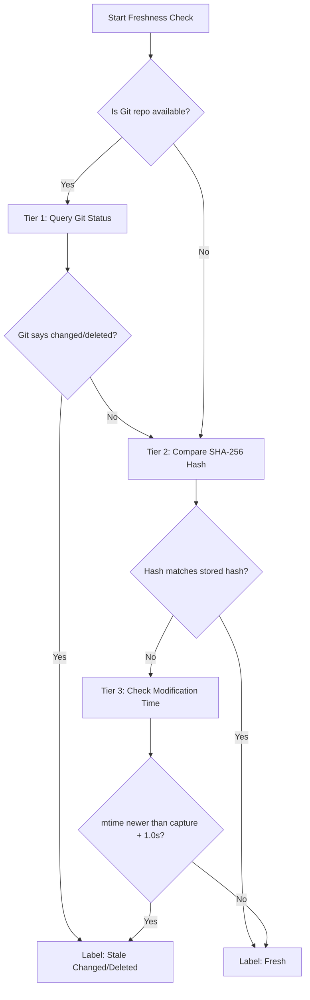

import { Aside } from '@astrojs/starlight/components';

Workspaces are highly dynamic. Coding agents and developers constantly edit files, create new tests, and delete old code. If you recall a record containing test failures or build diagnostics from two hours ago, you need to know: **does this record still represent the current state of the workspace?**

CtxSift automatically tracks **freshness** for every record. When you run `ctxsift recall`, it performs instant on-disk checks for every file referenced in the records and labels them accordingly.

---

## How freshness works: the 3-tier check pipeline

Whenever you compress a command, CtxSift extracts the files involved (e.g., `tests/test_auth.py`, `src/auth/tokens.py`) and captures their metadata:
- Whether the file existed at capture time.
- The SHA-256 hash of the file contents.
- The Git branch and HEAD hash.

When you later run `recall`, CtxSift resolves each file's path against your current workspace root and runs a three-tier checks pipeline:



### Tier 1: Git-aware workspace check (Highest Priority)
If the workspace is a Git repository, CtxSift runs:
```bash frame="none"
git status --porcelain -- <file_path>
```
If Git reports the file is modified (`M`), added (`A`), renamed (`R`), or untracked (`??`), it is marked as **changed**. If it is deleted (`D`), it is marked as **deleted**.

### Tier 2: Content Hash Verification (SHA-256)
If Git is not initialized or the file isn't tracked, CtxSift hashes the file on disk and compares it to the SHA-256 captured when the record was saved.
- **Hash match** = the file content is identical. Label: `fresh`.
- **Hash mismatch** = the file has changed. Label: `stale_changed`.

### Tier 3: Modification Time Verification (mtime)
If hashing is skipped or inconclusive, CtxSift compares the file's current modification time (`mtime`) on disk against the timestamp of when the record was captured.
If the file was modified *after* the record was captured (with a 1.0-second safety tolerance), it is marked as `stale_changed`.

---

## The aggregation rule: worst-case inheritance

A single compressed record can reference multiple files. For example, a test failure might touch three files:
1. `src/auth.py`
2. `tests/test_auth.py`
3. `package.json`

To keep status assessments safe, **the overall record freshness inherits the worst status of any single referenced file**.

| File A Status | File B Status | File C Status | Overall Record Status |
|---|---|---|---|
| `fresh` | `fresh` | `fresh` | **`fresh`** |
| `fresh` | `fresh` | `unknown` | **`unknown`** |
| `fresh` | `fresh` | `stale_changed` | **`stale_changed`** |
| `fresh` | `stale_changed` | `stale_deleted` | **`stale_deleted`** |

<Aside type="note">
If even one critical file is deleted, the entire record is treated as `stale_deleted` because the context surrounding that run is no longer intact.
</Aside>

---

## Detailed status guide

### `fresh`
- **What it means:** Every single file referenced in the record exists and has exactly the same contents as when the command ran.
- **Score impact:** Recalls get a **+6% bonus** to their score.
- **How to use it:** Treat this as high-fidelity truth. The build output, test results, or variables recorded in this session still apply to your current code.

### `stale_changed`
- **What it means:** At least one referenced file has been modified since the record was captured.
- **Score impact:** Recalls get a **−7% penalty** to their score.
- **How to use it:** Treat with caution. The trace logs or errors in the record are historical. They might contain hints about how to fix things, but they may refer to lines of code that have since changed or been refactored.

### `stale_deleted`
- **What it means:** A file that existed and was referenced during the command run has since been deleted from the workspace.
- **Score impact:** Recalls get a **−12% penalty** to their score.
- **How to use it:** Useful for retrospective debugging (e.g., "what was the build error of that file we ended up deleting?"), but not for immediate, active state restoration.

### `unverifiable`
- **What it means:** No file references were stored with this record.
- **Score impact:** Recalls get a **−1% penalty** to their score.
- **How to use it:** This typically happens for pipe-mode runs where you compressed arbitrary text without file contexts, or generic instructions like `ctxsift compress --intent summary "summarize how to deploy"`. Judge these records purely by the readability of their content.

### `unknown`
- **What it means:** CtxSift could not verify the files on disk, or the workspace path is no longer reachable.
- **Score impact:** No bonus or penalty (**0.0**).
- **How to use it:** Treat it conservatively. It means CtxSift lacks the telemetry to guarantee whether the files changed or not.

---

## Influence on recall ranking

Freshness is not just a visual label; it directly drives search relevance. The bonuses and penalties are added directly to the hybrid RRF (Reciprocal Rank Fusion) ranking score:

- **`fresh` records bubble to the top** when competing with similar search matches.
- **`stale` records sink to the bottom**, ensuring the agent does not accidentally act on outdated error logs when newer logs are available.

This feedback loop ensures that the agent's active context stays aligned with what is physically on the disk right now.
