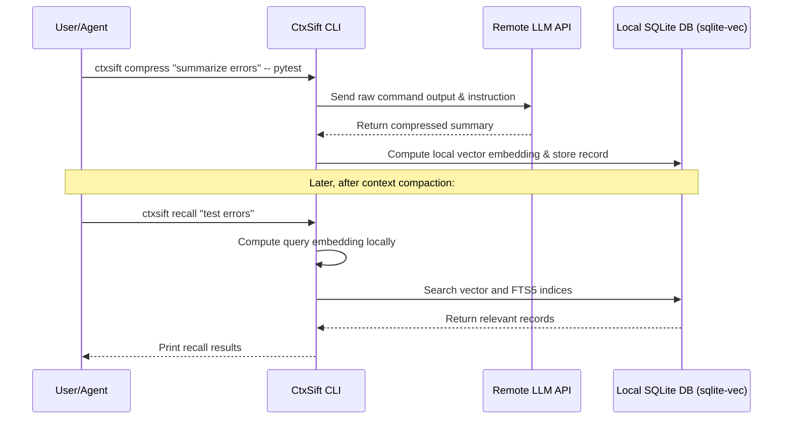

import { Aside } from '@astrojs/starlight/components';

While running CtxSift locally is ideal for offline work and maximum privacy, you can configure CtxSift to run inference on remote model providers. This is useful if:
- Your local machine lacks a dedicated GPU and CPU compression is too slow.
- You want to use state-of-the-art hosted models (like `gpt-4o-mini` or `claude-3-5-haiku`) for compression accuracy.

CtxSift integrates with **LiteLLM** to handle remote requests. This means any provider supported by LiteLLM can be targeted by simply changing the endpoint configuration.

---

## Install remote dependencies

Remote mode requires `litellm` and other networking dependencies. Install them using the `remote` extra:

```bash
uv tool install "ctxsift[remote]"
```

---

## Basic remote configuration

To route compression requests to a remote provider, you must configure the base URL, model name, and API key.

```bash
# Configure the API base endpoint
ctxsift config set remote.base_url https://api.openai.com/v1

# Choose the remote model
ctxsift config set remote.model_name gpt-4o-mini

# Set the API Key
ctxsift config set remote.api_key YOUR_API_KEY
```

Once `remote.base_url` is non-empty, CtxSift automatically redirects all compression runs to the remote endpoint. 

---

## Provider examples

Here are configuration commands for common model providers:

### OpenAI

```bash
ctxsift config set remote.base_url "https://api.openai.com/v1"
ctxsift config set remote.model_name "gpt-4o-mini"
ctxsift config set remote.api_key "sk-proj-..."
```

### Anthropic

```bash
ctxsift config set remote.base_url "https://api.anthropic.com/v1"
ctxsift config set remote.model_name "claude-3-5-haiku-20241022"
ctxsift config set remote.api_key "sk-ant-..."
```

### Local proxies (Ollama / vLLM / LM Studio)

If you are hosting a model locally but on a separate server or container, route requests to the OpenAI-compatible proxy port:

```bash
ctxsift config set remote.base_url "http://localhost:11434/v1" # Ollama port
ctxsift config set remote.model_name "qwen2.5-coder:1.5b"
ctxsift config set remote.api_key "ollama" # Dummy key
```

---

## The `reasoning_mode` setting

```bash
ctxsift config set remote.reasoning_mode auto
```

Some hosted models (like OpenAI's `o1`/`o3-mini` or DeepSeek `R1`) perform internal chain-of-thought reasoning before producing output. 
- **`true`**: Force CtxSift to use API options compatible with reasoning models (e.g. passing reasoning token limits or structured outputs adjustments).
- **`false`**: Force standard system-message chat completion.
- **`auto`** (Default): Automatically enables reasoning support if the model name matches typical reasoning models (e.g. matches `o1`, `o3`, or `deepseek-r1`).

---

## Hybrid architecture: remote compression, local recall

Even when you enable remote compression, **embeddings and search queries are computed and run locally**. 



This hybrid model ensures:
1. **Low-latency recall:** Searching the database takes less than 50ms because no external API is hit.
2. **Zero-cost search:** You don't pay provider token costs for querying or searching your history.
3. **Offline recall:** You can still search and read your local history even when you lose internet connectivity.
