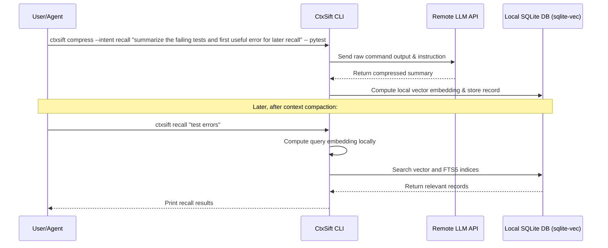

import { Aside } from '@astrojs/starlight/components';

While running CtxSift locally is ideal for offline work and maximum privacy, you can configure CtxSift to run inference on remote model providers. This is useful if:
- Your local machine lacks a dedicated GPU and CPU compression is too slow.
- You want to use state-of-the-art hosted models (like `gpt-4o-mini` or `claude-3-5-haiku`) for compression accuracy.

CtxSift integrates with **LiteLLM** to handle remote requests. This means any provider supported by LiteLLM can be targeted by simply changing the endpoint configuration.

---

## Install remote dependencies

Remote mode requires `litellm` and other networking dependencies. Install them using the `remote` extra:

```bash frame="none"
uv tool install "ctxsift[remote]"
```

---

## Basic remote configuration

To route compression requests to a remote provider, you must configure the base URL, model name, and API key.

```bash frame="none"
# Configure the API base endpoint
ctxsift config set remote.base_url https://api.openai.com/v1

# Choose the remote model
ctxsift config set remote.model_name gpt-4o-mini

# Set the API Key
ctxsift config set remote.api_key YOUR_API_KEY
```

Once `remote.base_url` is non-empty, CtxSift automatically redirects all compression runs to the remote endpoint. 

---

## Latest tested remote models

These rows come from the latest local remote benchmark snapshot at `benchmark/results/remote-models-20260523T233753Z`. They are sorted by average latency, fastest first, because the practical remote choice is usually a latency-versus-quality tradeoff, not just a score chase. `Score` here means the benchmark's main recovered score.

| Model | Avg. Inference (s) | Score | Comments |
|---|:-:|:-:|---|
| `gpt-4.1` | 1.33 | **88.17** | Best remote model in the current run and also the fastest among the top-tier results. Highest-quality hosted option right now. |
| `gpt-4o` | 1.43 | 86.28 | Strong all-rounder with good speed and quality. Better current result than `gpt-4o-mini`, but with more rejects than `gpt-4.1`. |
| `gpt-4o-mini` | 1.52 | 84.61 | Very fast and very reliable, with only 1 rejected case. Good hosted default when cost matters more than absolute top score. |
| `gpt-4.1-mini` | 1.59 | 86.99 | Close to `gpt-4.1` quality while staying quick. Strong pick if you want most of the quality without using the flagship model. |
| `gpt-5.4-nano` | 1.83 | 85.73 | Fast and solid in the current run. Worth considering if you specifically want this family. |
| `gpt-5.4-mini` | 2.11 | 86.68 | Highest accepted-case count in the remote set, but slightly slower than the 4.1 and 4o family models above it. |
| `gpt-5-nano` | 4.46 | 5.59 | Catastrophic benchmark result for CtxSift right now. Do not use this for compression. |
| `gpt-5-mini` | 7.40 | 32.13 | Also performed poorly in the current run, with many empty or invalid outputs. Not recommended. |

<Aside type="tip">
If you want the strongest hosted result, use `gpt-4.1`. If you want a fast and cheaper everyday hosted default, `gpt-4o-mini` is the safest current pick.
</Aside>

---

## Provider examples

Here are configuration commands for common model providers:

### OpenAI

```bash frame="none"
ctxsift config set remote.base_url "https://api.openai.com/v1"
ctxsift config set remote.model_name "gpt-4o-mini"
ctxsift config set remote.api_key "sk-proj-..."
```

### Anthropic

```bash frame="none"
ctxsift config set remote.base_url "https://api.anthropic.com/v1"
ctxsift config set remote.model_name "claude-3-5-haiku-20241022"
ctxsift config set remote.api_key "sk-ant-..."
```

### Local proxies (Ollama / vLLM / LM Studio)

If you are hosting a model locally but on a separate server or container, route requests to the OpenAI-compatible proxy port:

```bash frame="none"
ctxsift config set remote.base_url "http://localhost:11434/v1" # Ollama port
ctxsift config set remote.model_name "qwen2.5-coder:1.5b"
ctxsift config set remote.api_key "ollama" # Dummy key
```

---

## The `reasoning_mode` setting

```bash frame="none"
ctxsift config set remote.reasoning_mode auto
```

Some hosted models (like OpenAI's `o1`/`o3-mini` or DeepSeek `R1`) perform internal chain-of-thought reasoning before producing output. 
- **`true`**: Force CtxSift to use API options compatible with reasoning models (e.g. passing reasoning token limits or structured outputs adjustments).
- **`false`**: Force standard system-message chat completion.
- **`auto`** (Default): Automatically enables reasoning support when the configured model name matches well-known reasoning families. Today that includes:
  - OpenAI reasoning families such as `o1`, `o3`, `o4-mini`, and the `gpt-5*` family except chat-style variants like `gpt-5-chat` or `gpt-5-instant`.
  - DeepSeek reasoning aliases such as `deepseek-reasoner` and `deepseek-r1`.
  - Common "thinking" model names such as Gemini `gemini-2.5-*`, Anthropic `claude-sonnet-4` / `claude-opus-4` / `claude-3-7-sonnet`, and explicit aliases that contain terms like `thinking`, `reasoning`, or `reasoner`.

If you use a custom deployment name that hides the underlying family, `auto` may not detect it. In that case, set `remote.reasoning_mode` to `true` or `false` explicitly.

---

## Hybrid architecture: remote compression, local recall

Even when you enable remote compression, **embeddings and search queries are computed and run locally**. 



This hybrid model ensures:
1. **Low-latency recall:** Searching the database takes less than 50ms because no external API is hit.
2. **Zero-cost search:** You don't pay provider token costs for querying or searching your history.
3. **Offline recall:** You can still search and read your local history even when you lose internet connectivity.
